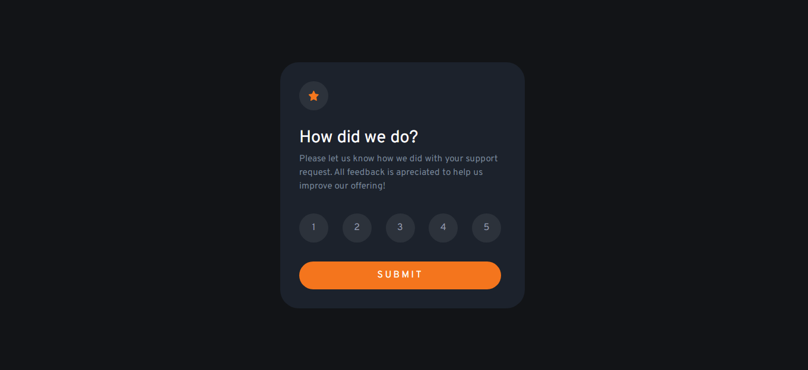

# Frontend Mentor - Interactive rating component solution

This is a solution to the [Interactive rating component challenge on Frontend Mentor](https://www.frontendmentor.io/challenges/interactive-rating-component-koxpeBUmI). Frontend Mentor challenges help you improve your coding skills by building realistic projects.

## Table of contents

- [Overview](#overview)
  - [The challenge](#the-challenge)
  - [Screenshot](#screenshot)
- [My process](#my-process)
  - [Built with](#built-with)
  - [Some thoughts](#some-thoughts)
  - [Continued development](#continued-development)
  - [Useful resources](#useful-resources)
- [Author](#author)
- [Acknowledgments](#acknowledgments)

## Overview

This challenge was fun to do because of the interaction of the card. With this project i learned a lot about how interaction works.

### The challenge

Users should be able to:

- View the optimal layout depending on their device's screen size
- See hover states for interactive elements

### Screenshot

### Built with

- HTML5 markup
- Flexbox
- Grid
- Animation
- JS
- Start implementing a bit of BEM principles.

### Some thoughts

- I struggled a bit in this project, but overall i think i did well.

### Continued development

I will focusing in developing my skills in frontend development, following the FrontendMentor site and personal projects.
I think that this is a great way to learn, by doing.

## Author

# Francisco Prado

- GitHub - [@franciscoprado04](https://github.com/franciscoprado4)
- Frontend Mentor - [@franciscoprado04](https://www.frontendmentor.io/profile/franciscoprado4)

## Acknowledgments

My inspiration is to become a great developer and deliver great solutions to the world. And of course, get a great job.
